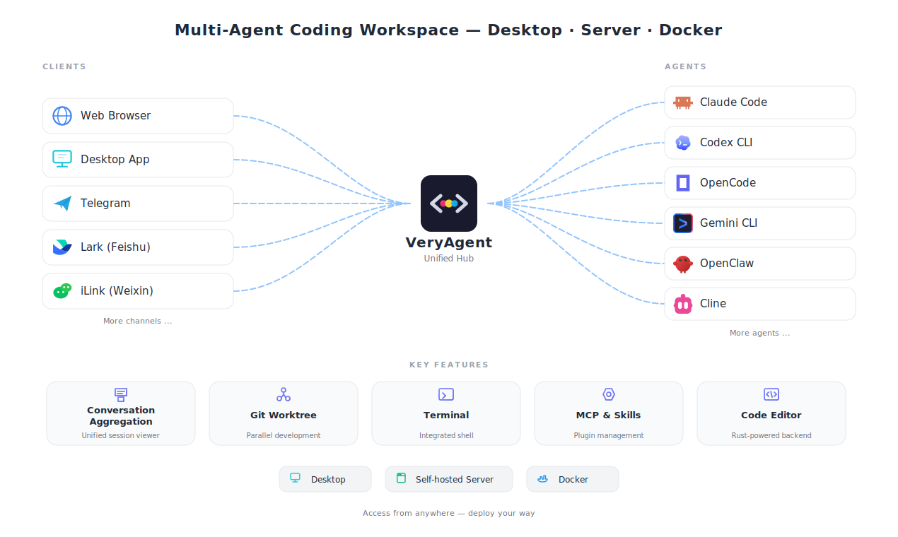

# VeryAgent

[](https://github.com/plhys/veryagent-plus/releases)
[](../../LICENSE)
[](https://tauri.app/)
[](https://nextjs.org/)
[](../../Dockerfile)

<p>
  <a href="../../README.md">English</a> |
  <a href="./README.zh-CN.md">简体中文</a> |
  <a href="./README.zh-TW.md">繁體中文</a> |
  <a href="./README.ja.md">日本語</a> |
  <a href="./README.ko.md">한국어</a> |
  <strong>Español</strong> |
  <a href="./README.de.md">Deutsch</a> |
  <a href="./README.fr.md">Français</a> |
  <a href="./README.pt.md">Português</a> |
  <a href="./README.ar.md">العربية</a>
</p>

VeryAgent (Code Generation) es un espacio de trabajo de codificación multiagente. Unifica varios agentes (Claude Code, Codex CLI, OpenCode, Gemini CLI, OpenClaw, Cline, Hermes Agent, CodeBuddy, Kimi Code, Pi, etc.) en un único espacio de trabajo, admite agregación de conversaciones y colaboración multiagente, y permite instalación de escritorio y despliegue en servidor/Docker.



## Patrocinadores

<table>
  <tr>
    <td colspan="2" align="center">
      <a href="https://myclaw.ai/?utm_source=github&utm_campaign=veryagent" target="_blank"></a><br/>
      <strong><a href="https://myclaw.ai/?utm_source=github&utm_campaign=veryagent">MyClaw.ai</a></strong> — Plataforma OpenClaw en la nube totalmente gestionada: despliegue en un clic, disponibilidad 24/7 y propiedad total de los datos, sin tener que administrar servidores.
    </td>
  </tr>
  <tr>
    <td align="center" width="220">
      <a href="https://www.compshare.cn/?ytag=GPU_YY_git_veryagent" target="_blank"></a><br/>
      <strong><a href="https://www.compshare.cn/?ytag=GPU_YY_git_veryagent">Compshare (UCloud)</a></strong>
    </td>
    <td>¡Gracias a Compshare por patrocinar este proyecto! Compshare es la plataforma de IA en la nube de UCloud, que ofrece planes Plan de agentes con modelos nacionales en suscripción mensual o por uso, desde 49 ¥/mes. También proporciona acceso estable a modelos extranjeros mediante proxy oficial. Compatible con Claude Code, Codex y llamadas a la API. Apto para empresas: alta concurrencia, soporte técnico 24/7 y facturación en autoservicio. ¡Los usuarios que se registren a través de <a href="https://www.compshare.cn/?ytag=GPU_YY_git_veryagent">este enlace</a> recibirán 5 ¥ de saldo de prueba gratis!</td>
  </tr>
  <tr>
    <td align="center" width="220">
      <a href="https://sui-xiang.com/register?aff=JPFCRHHBE8HE" target="_blank"></a><br/>
      <strong><a href="https://sui-xiang.com/register?aff=JPFCRHHBE8HE">随想AI中转站</a></strong>
    </td>
    <td>¡Gracias a 随想AI中转站 por patrocinar este proyecto! 随想AI中转站 es un proveedor de retransmisión de API fiable y eficiente, que ofrece servicios de retransmisión para Claude, Codex, Gemini y más. Las cuentas nuevas reciben 0,5 ¥ de crédito de prueba con cada registro de asistencia diario tras <a href="https://sui-xiang.com/register?aff=JPFCRHHBE8HE">registrarse</a>; las recargas se acreditan 1:1, sin suscripción y con pago por uso. La redundancia multilínea, la recuperación ante desastres entre regiones y la conmutación por error automática mantienen sin interrupciones las conexiones SSE de larga duración.</td>
  </tr>
</table>

> ¿Quieres convertirte en patrocinador de VeryAgent? [Contáctanos por correo electrónico.](mailto:itpkcn@gmail.com)

## Interfaz principal


## Colaboración Multi-Agente


## Flujo de trabajo de Office


## Puntos destacados

- **Agregación de conversaciones** — importa las sesiones de todos los agentes compatibles en un espacio de trabajo unificado
- **Colaboración multi-agente** — dentro de una misma sesión, el agente principal delega en sub-agentes de distintos tipos (p. ej. Claude Code llamando a Codex, Gemini) para completar una tarea de forma conjunta, ejecutándose cada uno como una sesión independiente
- Desarrollo paralelo con flujos integrados de `git worktree`
- **Inicio de Proyecto** — crea nuevos proyectos visualmente con vista previa en tiempo real
- **Documentos Office** — crea, analiza, revisa y edita archivos .docx / .xlsx / .pptx con el toolset officecli integrado; vista previa en tiempo real en pestaña de archivo que se actualiza mientras el agente edita
- **Automatizaciones** — guarda cualquier configuración del compositor como automatización reutilizable que se ejecuta de forma desatendida según cron o bajo demanda
- **Canales de Chat** — conecta Telegram, Lark (Feishu), iLink (Weixin) y más a tus agentes de codificación para notificaciones en tiempo real, interacción completa con sesiones y control remoto de tareas
- Gestión de MCP (escaneo local + búsqueda/instalación desde registro)
- Gestión de Skills (ámbito global y por proyecto)
- Gestión de cuentas remotas de Git (GitHub y otros servidores Git)
- Modo de servicio web — accede a VeryAgent desde cualquier navegador para trabajo remoto
- **Despliegue como servidor independiente** — ejecuta `veryagent-server` en cualquier servidor Linux/macOS, accede desde el navegador
- **Soporte Docker** — `docker compose up` o `docker run`, con token/puerto personalizables, persistencia de datos y montaje de directorios de proyecto
- Registros de ejecución — visor de registros en tiempo real integrado con filtrado y niveles de registro por módulo
- Ciclo de ingeniería integrado (árbol de archivos, diff, cambios git, commit, terminal)

## Agentes compatibles

| Agente       | Ruta de variable de entorno           | Ruta por defecto en macOS / Linux     | Ruta por defecto en Windows                           |
| ------------ | ------------------------------------- | ------------------------------------- | ----------------------------------------------------- |
| Claude Code  | `$CLAUDE_CONFIG_DIR/projects`         | `~/.claude/projects`                  | `%USERPROFILE%\\.claude\\projects`                    |
| Codex CLI    | `$CODEX_HOME/sessions`                | `~/.codex/sessions`                   | `%USERPROFILE%\\.codex\\sessions`                     |
| OpenCode     | `$XDG_DATA_HOME/opencode/opencode.db` | `~/.local/share/opencode/opencode.db` | `%USERPROFILE%\\.local\\share\\opencode\\opencode.db` |
| Gemini CLI   | `$GEMINI_CLI_HOME/.gemini`            | `~/.gemini`                           | `%USERPROFILE%\\.gemini`                              |
| OpenClaw     | —                                     | `~/.openclaw/agents`                  | `%USERPROFILE%\\.openclaw\\agents`                    |
| Cline        | `$CLINE_DIR`                          | `~/.cline/data/tasks`                 | `%USERPROFILE%\\.cline\\data\\tasks`                  |
| Hermes Agent | `$HERMES_HOME/state.db`               | `~/.hermes/state.db`                  | `%USERPROFILE%\\.hermes\\state.db`                    |
| CodeBuddy    | `$CODEBUDDY_CONFIG_DIR/projects`      | `~/.codebuddy/projects`               | `%USERPROFILE%\\.codebuddy\\projects`                 |
| Kimi Code    | `$KIMI_CODE_HOME/sessions`            | `~/.kimi-code/sessions`               | `%USERPROFILE%\\.kimi-code\\sessions`                 |
| Pi           | `$PI_CODING_AGENT_SESSION_DIR`        | `~/.pi/agent/sessions`                | `%USERPROFILE%\\.pi\\agent\\sessions`                 |

> Nota: las variables de entorno tienen prioridad sobre las rutas de respaldo.

<details>
<summary><h2>Inicio de Proyecto</h2></summary>

Crea nuevos proyectos visualmente con una interfaz de panel dividido: configura a la izquierda, vista previa en tiempo real a la derecha.


### Qué ofrece

- **Configuración visual** — selecciona estilo, tema de color, biblioteca de iconos, fuente, radio de borde y más desde menús desplegables; la vista previa se actualiza instantáneamente
- **Vista previa en vivo** — visualiza el aspecto elegido renderizado en tiempo real antes de crear nada
- **Creación con un clic** — presiona "Crear proyecto" y el launcher ejecuta `shadcn init` con tu preset, plantilla de framework (Next.js / Vite / React Router / Astro / Laravel) y gestor de paquetes (pnpm / npm / yarn / bun)
- **Detección de gestores de paquetes** — verifica automáticamente qué gestores están instalados y muestra sus versiones
- **Integración fluida** — el proyecto recién creado se abre directamente en el workspace de VeryAgent

Actualmente soporta scaffolding de proyectos **shadcn/ui**, con un diseño basado en pestañas preparado para más tipos de proyectos en el futuro.

</details>

<details>
<summary><h2>Canales de Chat</h2></summary>

Conecta tus aplicaciones de mensajería favoritas — Telegram, Lark (Feishu), iLink (Weixin) y más — a tus agentes de codificación IA. Crea tareas, envía mensajes de seguimiento, aprueba permisos, reanuda sesiones y monitorea la actividad directamente desde el chat — recibe respuestas del agente en tiempo real con detalles de llamadas a herramientas, solicitudes de permisos y resúmenes de finalización sin necesidad de abrir un navegador.

### Canales soportados

| Canal          | Protocolo                   | Estado    |
| -------------- | --------------------------- | --------- |
| Telegram       | Bot API (HTTP long-polling) | Integrado |
| Lark (Feishu)  | WebSocket + REST API        | Integrado |
| iLink (Weixin) | WebSocket + REST API        | Integrado |

> Se planean más canales (Discord, Slack, DingTalk, etc.) para futuras versiones.

</details>

<details>
<summary><h2>Documentos Office</h2></summary>

Trabaja con archivos Word, Excel y PowerPoint como un flujo de trabajo de primera clase. El toolset **officecli** integrado permite a tus agentes crear, analizar, revisar y editar documentos .docx, .xlsx y .pptx — y puedes previsualizar el resultado directamente en VeryAgent.

### Qué ofrece

- **Crear y editar** — genera nuevos documentos o modifica .docx / .xlsx / .pptx existentes, incluyendo gráficos, tablas y formato
- **Analizar y revisar** — inspecciona la estructura del documento, detecta problemas de formato y revisa el contenido
- **Vista previa en vivo** — abre un .docx / .xlsx / .pptx en una pestaña de archivo y se renderiza en línea, actualizándose automáticamente mientras el agente edita — respaldado por un servidor `officecli watch` permanente (con proxy inverso y autenticación por capacidad para entornos web y servidor)
- **Acciones rápidas** — la página de bienvenida ofrece pestañas de Codificación y Office que insertan la invocación de habilidad correspondiente y una plantilla de prompt con un solo clic; las habilidades no habilitadas muestran un badge de bloqueo y enlazan a donde puedes activarlas
- **Configuración de Office Tools** — una página de ajustes dedicada instala `officecli` y gestiona sus habilidades mediante una matriz de habilidad×agente: alterna cualquier par (habilidad, agente) y aplica cambios masivos

</details>

<details>
<summary><h2>Automatizaciones</h2></summary>

Convierte cualquier configuración del compositor — agente, modelo, prompt, directorio de trabajo y opciones — en una **Automatización** reutilizable que se ejecuta sin abrir la interfaz.

### Qué ofrece

- **Configurar una vez, reutilizar siempre** — guarda una configuración completa del compositor como automatización con nombre
- **Programada o bajo demanda** — ejecútala según un horario cron o lánzala manualmente cuando lo necesites
- **Ejecución desatendida** — las automatizaciones se ejecutan en segundo plano y crean sesiones reales que puedes abrir en el workspace en cualquier momento; tras iniciarlas, regresan automáticamente al workspace

</details>

<details>
<summary><h2>Inicio rápido</h2></summary>

### Requisitos

- Node.js `>=22` (recomendado)
- pnpm `>=10`
- Rust stable (2021 edition)
- Dependencias de compilación de Tauri 2 (solo modo escritorio)

Ejemplo para Linux (Debian/Ubuntu):

```bash
sudo apt-get update
sudo apt-get install -y \
  libwebkit2gtk-4.1-dev \
  libayatana-appindicator3-dev \
  librsvg2-dev \
  patchelf
```

### Binarios

VeryAgent distribuye tres binarios de Rust desde un único workspace:

| Binario        | Rol                                                                                                          | Compilación                                                                |
| -------------- | ------------------------------------------------------------------------------------------------------------ | -------------------------------------------------------------------------- |
| `veryagent`        | Aplicación de escritorio Tauri (ventana, bandeja, actualizador)                                              | `pnpm tauri build` (release) / `pnpm tauri dev` (dev)                      |
| `veryagent-server` | Servidor HTTP + WebSocket independiente para despliegues en navegador/sin interfaz                           | `pnpm server:build` / `pnpm server:dev`                                    |
| `veryagent-mcp`    | Compañero stdio MCP por lanzamiento que expone la herramienta `delegate_to_agent` a las CLI de agentes (colaboración multi-agente) | `pnpm tauri:prepare-sidecars` (invocado automáticamente por `tauri dev` / `tauri build`) |

`veryagent-mcp` debe ubicarse junto a su binario padre en tiempo de ejecución — los instaladores, la imagen Docker y el empaquetador de sidecars de Tauri lo colocan junto a `veryagent` / `veryagent-server`. Las compilaciones desde fuente y los diseños personalizados pueden anular la búsqueda con la variable de entorno `VERYAGENT_MCP_BIN=/abs/path/veryagent-mcp`. Si el compañero falta, la delegación se omite (se registra una única advertencia) y el resto de la sesión del agente sigue funcionando.

### Desarrollo

```bash
pnpm install

# Solo frontend (servidor de desarrollo de Next.js, sin Rust)
pnpm dev

# Exportación estática del frontend a out/
pnpm build

# Aplicación de escritorio completa (Tauri + Next.js, compila automáticamente el sidecar veryagent-mcp)
pnpm tauri dev

# Compilación de escritorio de release (incluye veryagent-mcp como externalBin)
pnpm tauri build

# Servidor independiente (sin Tauri/GUI necesario)
pnpm server:dev
pnpm server:build                  # binario de release en src-tauri/target/release/veryagent-server

# Compilar explícitamente el compañero veryagent-mcp (para el triple del host)
pnpm tauri:prepare-sidecars        # salida: src-tauri/binaries/veryagent-mcp-<triple>

# Saltar la preparación del sidecar al iterar el frontend cuando no necesitas delegación
VERYAGENT_SKIP_SIDECAR=1 pnpm tauri dev

# Lint
pnpm eslint .

# Pruebas frontend (vitest)
pnpm test
pnpm test:watch
pnpm test:coverage

# Verificaciones de Rust (ejecutar en src-tauri/)
cargo check                                                     # escritorio (features por defecto)
cargo check --no-default-features --bin veryagent-server            # modo servidor
cargo check --no-default-features --bin veryagent-mcp               # compañero MCP
cargo clippy --all-targets --features test-utils -- -D warnings

# Pruebas de Rust
cargo test --features test-utils                                # escritorio (incl. integración)
cargo test --no-default-features --bin veryagent-server --lib       # modo servidor
cargo insta review                                              # aceptar actualizaciones de snapshots del parser
```

> Sugerencia: cuando tengas una compilación reciente de `veryagent-mcp` en `src-tauri/target/release/` y quieras apuntar un `veryagent-server` lanzado manualmente sin reinstalar, exporta `VERYAGENT_MCP_BIN=$(pwd)/src-tauri/target/release/veryagent-mcp`.

### Despliegue del servidor

VeryAgent puede ejecutarse como un servidor web independiente sin entorno de escritorio.

#### Opción 1: Instalación en una línea (Linux / macOS)

```bash
curl -fsSL https://raw.githubusercontent.com/plhys/veryagent-plus/main/install.sh | bash
```

Instalar una versión específica o en un directorio personalizado:

```bash
curl -fsSL https://raw.githubusercontent.com/plhys/veryagent-plus/main/install.sh | bash -s -- --version v0.5.2 --dir ~/.local/bin
```

Luego ejecutar:

```bash
veryagent-server
```

#### Opción 2: Instalación en una línea (Windows PowerShell)

```powershell
irm https://raw.githubusercontent.com/plhys/veryagent-plus/main/install.ps1 | iex
```

O instalar una versión específica:

```powershell
.\install.ps1 -Version v0.5.2
```

#### Opción 3: Descargar desde GitHub Releases

Los binarios precompilados (con recursos web incluidos) están disponibles en la página de [Releases](https://github.com/plhys/veryagent-plus/releases):

| Plataforma  | Archivo                            |
| ----------- | ---------------------------------- |
| Linux x64   | `veryagent-server-linux-x64.tar.gz`    |
| Linux arm64 | `veryagent-server-linux-arm64.tar.gz`  |
| macOS x64   | `veryagent-server-darwin-x64.tar.gz`   |
| macOS arm64 | `veryagent-server-darwin-arm64.tar.gz` |
| Windows x64 | `veryagent-server-windows-x64.zip`     |

```bash
# Ejemplo: descargar, extraer y ejecutar
tar xzf veryagent-server-linux-x64.tar.gz
cd veryagent-server-linux-x64
VERYAGENT_STATIC_DIR=./web ./veryagent-server
```

#### Opción 4: Docker

```bash
# Usando Docker Compose (recomendado)
docker compose up -d

# O ejecutar directamente con Docker
docker run -d -p 3080:3080 -v veryagent-data:/data ghcr.io/plhys/veryagent-plus:latest

# Con token personalizado y directorio de proyecto montado
docker run -d -p 3080:3080 \
  -v veryagent-data:/data \
  -v /path/to/projects:/projects \
  -e VERYAGENT_TOKEN=your-secret-token \
  ghcr.io/plhys/veryagent-plus:latest
```

La imagen Docker utiliza una compilación multi-etapa (Node.js + Rust → runtime Debian slim) e incluye `git` y `ssh` para operaciones con repositorios. Los datos se persisten en el volumen `/data`. Opcionalmente, puedes montar directorios de proyecto para acceder a repositorios locales desde el contenedor.

#### Opción 5: Compilar desde el código fuente

```bash
pnpm install && pnpm build          # compilar frontend
cd src-tauri
cargo build --release --bin veryagent-server --no-default-features
cargo build --release --bin veryagent-mcp --no-default-features    # compañero de delegación
VERYAGENT_STATIC_DIR=../out ./target/release/veryagent-server          # veryagent-mcp se detecta como hermano
```

Si mantienes los dos binarios en directorios separados, define `VERYAGENT_MCP_BIN=/abs/path/to/veryagent-mcp` para que el runtime pueda seguir encontrando el compañero; sin esto, la delegación multi-agente se desactiva silenciosamente.

#### Configuración

Variables de entorno:

| Variable                       | Valor por defecto      | Descripción                                                                                                                                                                                                                                                                                                                                                                                                                                                                                                                          |
| ------------------------------ | ---------------------- | ------------------------------------------------------------------------------------------------------------------------------------------------------------------------------------------------------------------------------------------------------------------------------------------------------------------------------------------------------------------------------------------------------------------------------------------------------------------------------------------------------------------------------------ |
| `VERYAGENT_PORT`                   | `3080`                 | Puerto HTTP                                                                                                                                                                                                                                                                                                                                                                                                                                                                                                                          |
| `VERYAGENT_HOST`                   | `0.0.0.0`              | Dirección de enlace                                                                                                                                                                                                                                                                                                                                                                                                                                                                                                                  |
| `VERYAGENT_TOKEN`                  | _(aleatorio)_          | Token de autenticación (se imprime en stderr al iniciar)                                                                                                                                                                                                                                                                                                                                                                                                                                                                             |
| `VERYAGENT_DATA_DIR`               | `~/.local/share/veryagent` | Directorio de la base de datos SQLite (también raíz de `uploads/`, `pets/`)                                                                                                                                                                                                                                                                                                                                                                                                                                                          |
| `VERYAGENT_STATIC_DIR`             | `./web` o `./out`      | Directorio de exportación estática de Next.js                                                                                                                                                                                                                                                                                                                                                                                                                                                                                        |
| `VERYAGENT_MCP_BIN`                | _(sin definir)_        | Ruta absoluta al compañero `veryagent-mcp`. Anula la búsqueda por defecto de hermano-del-ejecutable + `PATH`. Úsalo para compilaciones desde fuente o diseños personalizados donde el compañero reside fuera del directorio de instalación del servidor.                                                                                                                                                                                                                                                                                  |
| `VERYAGENT_SKIP_SIDECAR`           | _(sin definir)_        | Conveniencia solo de frontend para `pnpm tauri dev` / `pnpm tauri build` — cuando vale `1`, omite la compilación del sidecar `veryagent-mcp`. La delegación queda desactivada en esa compilación; los artefactos de calidad de release deben dejarla sin definir.                                                                                                                                                                                                                                                                        |
| `VERYAGENT_UPLOAD_MAX_TOTAL_BYTES` | _(sin definir)_        | Límite máximo de bytes totales residentes en `<data dir>/uploads/`. Conteo de bytes en decimal (p. ej. `10737418240` para 10 GiB). Si no se define, vale `0` o tiene un valor no analizable, el límite se desactiva y se imprime una línea de inicio para que la configuración sea visible. El límite se aplica dentro de un único proceso `veryagent-server` — los despliegues escalados horizontalmente que comparten un mismo volumen `uploads/` requieren coordinación externa (bloqueo de archivos, Redis, cuota de proxy inverso). |
| `VERYAGENT_UPLOAD_QUOTA_STRICT`    | _(sin definir)_        | Cuando es verdadero (`1` / `true` / `yes` / `on`), aborta el inicio con código de salida 2 si `VERYAGENT_UPLOAD_MAX_TOTAL_BYTES` tiene un valor no analizable, en vez de continuar con un WARN. Úselo cuando su política de seguridad requiera que «la cuota configurada debe ser efectiva».                                                                                                                                                                                                                                             |

</details>

<details>
<summary><h2>Arquitectura</h2></summary>

```text
Next.js 16 (Static Export) + React 19
        |
        | invoke() (desktop) / fetch() + WebSocket (web)
        v
  ┌─────────────────────────┐
  │   Transport Abstraction  │
  │  (Tauri IPC or HTTP/WS) │
  └─────────────────────────┘
        |
        v
┌─── Tauri Desktop ───┐    ┌─── veryagent-server ───┐
│  Tauri 2 Commands    │    │  Axum HTTP + WS    │
│  (window management) │    │  (standalone mode)  │
└──────────┬───────────┘    └──────────┬──────────┘
           └──────────┬───────────────┘
                      v
            Shared Rust Core
              |- AppState
              |- ACP Manager
              |- Parsers (conversation ingestion)
              |- Chat Channels
              |- Git / File Tree / Terminal
              |- MCP marketplace + config
              |- Office Tools (officecli) + Automations
              |- SeaORM + SQLite
                      |
              ┌───────┼───────┐
              v       v       v
  Local Filesystem  Git   Chat Channels
    / Git Repos    Repos  (Telegram, Lark, iLink)
```

</details>

## Privacidad y seguridad

- Enfoque local por defecto para análisis, almacenamiento y operaciones de proyecto
- El acceso a la red solo ocurre mediante acciones iniciadas por el usuario
- Soporte de proxy del sistema para entornos empresariales
- El modo de servicio web utiliza autenticación basada en tokens

## Comunidad

- Escanea el código QR de abajo para unirte a nuestro grupo de WeChat para discusiones, comentarios y actualizaciones


- Gracias a la comunidad de [LinuxDO](https://linux.do) por su apoyo

## Coffee

- Si VeryAgent te ha resultado útil, considera invitarme a un café


## Agradecimientos

- [ACP](https://agentclientprotocol.com) — el Agent Client Protocol (ACP) es la base que permite a VeryAgent conectarse con múltiples agentes
- [Superpowers](https://github.com/obra/superpowers) — impulsa el módulo de habilidades de expertos de VeryAgent
- [OfficeCLI](https://github.com/iOfficeAI/OfficeCLI) — impulsa el flujo de trabajo de documentos Office de VeryAgent

## Licencia

Apache-2.0. Ver `LICENSE`.
